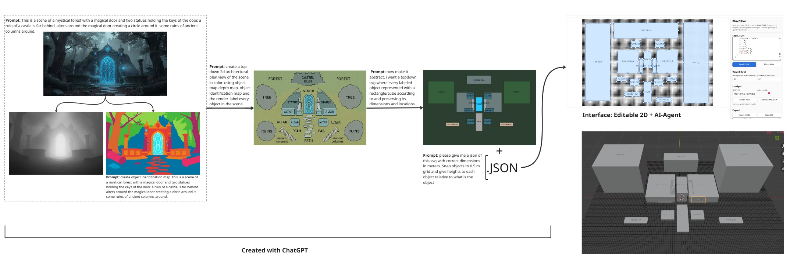
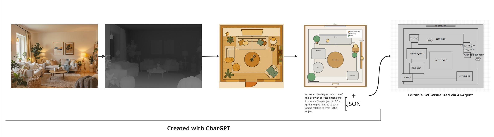

# ATLAS Scene Agent

**Real-time 2D layout editor with AI scene generation and Blender live-sync.**

This repository hosts the MVP for the **ATLAS Scene Design Agent**, combining:
- A **web-based 2D plan editor** (drag, resize, snap-to-grid)
- A **Flask AI agent backend** that interprets text prompts and edits the scene
- **Blender live-sync**, updating the 3D environment in real time
- Example scenes with render, depth, object-ID maps, SVG, and JSON formats

---

## Features
- **Natural language control:** Ask the agent to add, mirror, or align objects.
- **Interactive editor:** Drag and resize shapes on a grid-based 2D layout.
- **Live synchronization:** Edits instantly reflected in Blender.
- **SVG + JSON generation:** The agent outputs schematic top-down plans directly from text.
- **Scene editing:** Load existing JSONs (e.g. generated from renders) and modify them with agent commands.
- **Demo examples:** “magical_forest” and “room” scenes with AI-generated assets.
---

## 🧭 Workflow Overview

The workflow shows how an AI-generated render is converted into structured design data (SVG + JSON) and visualized in the real-time editor.

<p align="center">
  <br>
  <em>Example 1 — Mystical Forest Scene: From render → object maps → top-down plan → editable JSON in the AI agent.</em>
</p>

<p align="center">
  <br>
  <em>Example 2 — Interior Scene: From render → top view abstraction → JSON visualization via AI agent.</em>
</p>

---


---

## 🗂 Project Structure
```plaintext
atlas-scene-agent/
│
├── ai_agent.py # Core logic (prompt interpretation and SVG/JSON generation)
├── server.py # Flask server and live JSON writer
├── plan_editor.html # 2D layout editor (browser UI)
│
├── examples/
│ ├── magical_forest/
│ │ ├── render.png
│ │ ├── depth.png
│ │ ├── objmap.png
│ │ ├── plan.json
│ │ ├── plan.svg
│ │ ├── prompt.txt
│ └── room/
│ ├── render.png
│ ├── plan.json
│ ├── plan.svg
│ ├── prompt.txt
│
├── blender_livesync.py # Blender script watching live_scene.json
└── live_scene.json # Shared file updated by server and Blender
```

---

## ⚙️ Setup

### 1. Clone and enter
```bash
git clone https://github.com/MisraSerenayy/atlas-scene-agent.git
cd atlas-scene-agent
```
### 2. Create environment
```bash
conda activate "your_env_name"  # or python -m venv venv
pip install -r requirements.txt
```
### 3. Add your OpenAI API key
Create a file named .env in the project root:
```bash
OPENAI_API_KEY=sk-yourkey
OPENAI_AGENT_MODEL=gpt-4.1
```
Do not commit this file. Git ignores it automatically.

If you prefer, you can copy .env.example and rename it to .env.

### 4. Run the server
```bash
python server.py
```
This writes and updates live_scene.json in real time.

### 5. Open the editor
Open plan_editor.html in your browser.
You can paste a JSON from the examples folder and edit the scene by dragging or interacting with the AI agent.

### 6. Blender live-sync
Run blender_livesync.py inside Blender’s scripting panel.
Any change in live_scene.json updates the 3D view automatically.

🧩 Current Functionality (MVP)
The AI agent understands natural language prompts such as
“Add an object named castle_ruin to the north” or “Mirror the forest on the left.”

From text, it produces both a JSON scene file and an SVG layout (top-down schematic).

It can load an existing JSON (for example generated from a render via ChatGPT) and
edit or expand that scene by adding new objects or changing dimensions.

Users can then visualize and refine the scene interactively in the 2D editor.

The Flask server synchronizes all updates to live_scene.json,
enabling real-time visualization in Blender.

🧪 Example Demo
To try the included demo:

Start the server.

Open the web editor.

Copy-Paste an example JSON.

Click Load JSON.

Interact with the 2D view to edit the scene.

Click Publish to write live_scene.json and preview the scene in Blender.

## 🎥 Demo


https://github.com/user-attachments/assets/10edf0c1-89fa-496c-a454-b7e81f00557a


<p align="center">
  <br>
  <em>Real-time 2D layout editor with AI-assisted scene generation and Blender live-sync.</em>
</p>

🪄 Roadmap
 Inline vision module to generate SVG/JSON directly from RGB + depth renders.

 Expanded agent command set (stairs, walls, etc.).

 Assigning the created assets with object labels.

 Multi-user collaboration and persistent history.


🧠 Credits
Developed by Mısra Serenay Özgök Genç
ATLAS Collaboration, 2025
